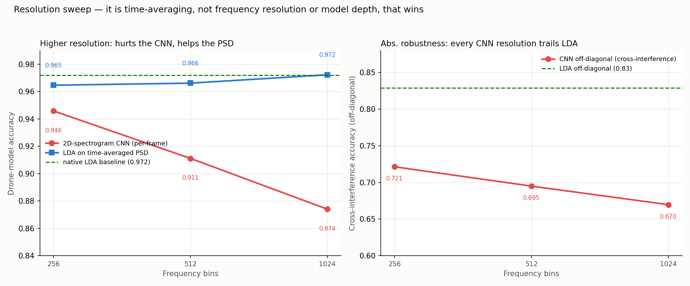

# DroneDetect Analysis Project

> 繁體中文版說明請見 [README.zh-TW.md](README.zh-TW.md)

Lossless conversion of the DroneDetect RF IQ dataset to parquet, a DuckDB summary layer on top of it, exploratory data analysis (EDA), and — the main result — a **PSD-based drone-model classifier** validated end to end against a spectrogram CNN. The goal is drone-model detection/classification research on raw RF signals.

## Key result & conclusion

**A normalized 1024-bin Welch PSD fed to a linear classifier (LDA) is the best-balanced drone-model classifier on this dataset** — 0.97 segment / 1.00 recording accuracy across the 7 models, most robust across interference, near-zero training cost, fully interpretable. This held up across every verification stage below; a spectrogram CNN learns *complementary* cues (significant McNemar difference, low CKA, ensemble gain) but never wins on accuracy or robustness.

- **Why PSD wins:** data quality forces it (a ~15 dB gain confound and clipping make absolute-amplitude features unusable, so the normalized PSD is the natural gain-invariant choice), spectral shape is almost linearly separable (XGBoost adds nothing over LDA), and the CNN scores lower and transfers across interference worse — even at *identical* 1024-bin resolution (0.874 vs. 0.972). The decisive factor is feature-level time-averaging, not resolution or model depth.
- **Deployment window:** with continuous clean observation prefer a single long window — **≈25 ms → 0.95**, **≈12.5 ms → 0.92**. Multi-window voting (use *soft* voting) does not beat one long window at equal observation time.
- **Hardest residual:** the same-family MP1↔MP2 pair (DJI Mavic Pro vs. Pro 2, same OcuSync downlink).
- **Structural limit:** model ≡ recording-session confound — cross-SDR / cross-day generalisation cannot be verified with this dataset.

Full evidence in [§Findings](#findings); every claim links its figure.

## Data source

- **Dataset**: DroneDetect Dataset — Radio Frequency Dataset of Unmanned Aerial System (UAS) Signals for Machine Learning
- **Authors**: Carolyn J. Swinney, John C. Woods
- **Link**: <https://ieee-dataport.org/open-access/dronedetect-dataset-radio-frequency-dataset-unmanned-aerial-system-uas-signals-machine>
- **DOI**: `10.21227/5jjj-1m32`

This repository contains only analysis code, design docs, and small derived artifacts (summary table, plots, metrics). Raw data, converted parquet, and large feature files are not version-controlled (see [.gitignore](.gitignore)); obtain the dataset from the source above.

## Dataset specification (from the authors)

| Item | Spec |
|---|---|
| Sample rate | 60 MS/s (complex) |
| Bandwidth | 28 MHz |
| Centre frequency | 2.4375 GHz |
| Recording length | 1.2×10⁸ complex samples (~2 s) |
| SDR | Nuand BladeRF |
| Recording software | GNURadio |
| Raw format | `.dat`, interleaved float32 (I, Q) |

**7 drone models** (folder code → model; MP1/MP2 mapping inferred from naming):

| Folder code | Filename prefix | Model |
|---|---|---|
| `AIR` | AIR | DJI Mavic 2 Air S |
| `DIS` | DIS | Parrot Disco |
| `INS` | INS | DJI Inspire 2 |
| `MIN` | MIN | DJI Mavic Mini |
| `MP1` | **MA1** | DJI Mavic Pro |
| `MP2` | **MAV** | DJI Mavic Pro 2 |
| `PHA` | PHA | DJI Phantom 4 |

> `MP1`/`MP2` filename prefixes (`MA1`/`MAV`) do not match their folder names. `drone_id` is therefore always parsed from the **folder name**, never the filename prefix.

**4 interference conditions** — `CLEAN` (00), `BLUE` Bluetooth (01), `WIFI` (10), `BOTH` (11) — and **3 flight modes** — switched on `ON` (00), hovering `HO` (01), flying `FY` (10). Filename scheme: `<DroneID>_<II><FF>_<RR>.dat` with `RR` = repeat index 00–04.

**Composition / known gaps** (check before any cross-model comparison):

| Model | Files | Note |
|---|---|---|
| AIR / INS / MIN / MP1 / MP2 | 60 each | full grid (4 interference × 3 modes × 5 runs) |
| DIS | 40 | fixed-wing, cannot hover — **no HO recordings** (by physics, not data loss) |
| PHA | 50 | missing `CLEAN/PHA_FY` and `BLUE/PHA_FY` (no flying recordings without WiFi) |

Total: **390 files**.

## Repository layout

```
load_data_transfer_parquet.py   # .dat -> parquet lossless conversion
verify_parquet_conversion.py    # bit-exact conversion verification
Summary_duckdb/summary.parquet  # 390-row per-recording summary table (committed)
EDA/        scripts + results   # box plots of summary features
embedding/  scripts + results   # 50 ms PSD features + LDA/XGBoost baselines
CNN/        scripts + results   # spectrogram extraction + small 2D CNN + Grad-CAM
verify/     scripts + results   # robustness, leakage & model-comparison checks
```

## Pipeline

### 1. Raw conversion (.dat → parquet)

[load_data_transfer_parquet.py](load_data_transfer_parquet.py) — bit-lossless: full-length reads, no normalisation, raw float32 `I`/`Q`, zstd compression, mirrors the source folder structure. Reads directly from the original zip. Verified by [verify_parquet_conversion.py](verify_parquet_conversion.py) (row counts + random bit-exact sampling on all 390 files, passed). See [PARQUET_SCHEMA_DESIGN.en.md](PARQUET_SCHEMA_DESIGN.en.md).

### 2. Summary DB (parquet → DuckDB)

`Summary_duckdb/build_summary.py` (local, not committed) builds a single 390-row wide table: classification metadata, distribution statistics, power features, acquisition diagnostics, and data-quality columns (`zero_ratio`, `clip_ratio`). The portable export [Summary_duckdb/summary.parquet](Summary_duckdb/summary.parquet) is committed.

### 3. EDA ([EDA/](EDA))

[EDA/scripts/summary_boxplots.py](EDA/scripts/summary_boxplots.py) renders box plots for each summary feature grouped by drone model / interference / flight mode, plus an overview grid (results in `EDA/results/`).

### 4. PSD embedding + baselines ([embedding/](embedding))

- [extract_psd_features.py](embedding/scripts/extract_psd_features.py): slices each recording into 40 × 50 ms segments, computes a 1024-bin two-sided Welch PSD per segment, normalises total power to 1 (gain-invariant spectral shape) then converts to dB. 15,591 segment rows.
- [baseline_classify.py](embedding/scripts/baseline_classify.py): leave-one-run-out CV (5 folds by `run_index`; segments of one recording never straddle folds), LDA + XGBoost, saturated segments (`clip_ratio > 5%`) excluded.

### 5. Spectrogram CNN ([CNN/](CNN))

- [extract_spectrograms.py](CNN/scripts/extract_spectrograms.py): same 50 ms segments → STFT (nperseg 1024, hop 512, two-sided), mean-pooled in the linear power domain to a 256(F)×128(T) grid, then dB, stored as float16 (~1 GB, not committed). Frequency bins are a CLI arg (256 default; 512 for the higher-resolution run).
- [train_cnn.py](CNN/scripts/train_cnn.py): ~200k-param 4-block 2D CNN, per-segment z-score (removes gain — additive in log domain), time-roll + noise augmentation, leave-one-run-out CV. Auto-detects a CUDA GPU, else trains on CPU with `cores − 2` threads; device only affects speed, not results. Saves per-fold weights to `CNN/models/` (committed — ~0.4 MB each) and exports predictions + 128-d embeddings for the comparison stage.
- [gradcam.py](CNN/scripts/gradcam.py): Grad-CAM over the last conv block, overlaid on one clean spectrogram per drone.

### 6. Verification ([verify/](verify))

- [interference_transfer.py](verify/scripts/interference_transfer.py): 4×4 train-condition × test-condition accuracy matrix (LDA).
- [model_comparison.py](verify/scripts/model_comparison.py): aligns LDA / XGBoost / CNN per-segment predictions — pairwise agreement, McNemar's test, exclusive-correct counts, 3-model ensemble.
- [session_leakage.py](verify/scripts/session_leakage.py): linear probes (GroupKFold by recording) on CNN embeddings and PSD features for `drone_id` / `run_index` / `interference` / `flight_mode`, plus CKA between the two representations.
- [cnn_interference_transfer.py](verify/scripts/cnn_interference_transfer.py): trains one model per interference condition (runs 0–3) and tests on every condition, for both CNN and LDA under one protocol.
- [segment_length_sweep.py](verify/scripts/segment_length_sweep.py): single-window LDA accuracy vs. observation-window length (0.39–50 ms) by slicing the spectrogram time axis.
- [multiwindow_voting.py](verify/scripts/multiwindow_voting.py): V non-overlapping short windows (hard/soft vote) vs. one long window at equal observation time.
- [gain_perturbation.py](verify/scripts/gain_perturbation.py): ±dB test-time gain, normalized vs. un-normalized PSD accuracy.

## Findings

### Data quality

1. **Gain confound (~15 dB) splits the dataset into two groups**: AIR/DIS/PHA were recorded hot (avg −17…−26 dBFS, `max_I` ≈ 0.8–1.0) and INS/MIN/MP1/MP2 cold (−35…−39 dBFS). This reflects acquisition gain/distance, not the drones. **Any absolute-amplitude feature is confounded**; per-recording/per-segment normalisation is mandatory — this is what forces the normalized-PSD choice.
   → 
2. **Clipping**: ~50–60% of AIR/DIS/PHA recordings touch ADC full-scale; the weak-signal group is clean. Two PHA recordings are severely saturated (`BLUE/PHA_ON/PHA_0100_00` 30%, `CLEAN/PHA_ON/PHA_0000_01` 26% of samples) and should be excluded from spectral analysis. `clip_ratio` in the summary table quantifies this per recording.
   → 
3. Scalar statistics (`avg_power`, `rms`, `std`) carry no reliable model-discriminative signal — dominated by the gain confound and, within groups, by flight-mode variance. The scale-invariant pair `iq_correlation`/`iq_imbalance_db` separates models better (RF 5-fold ≈ 0.57 with 2 features) but plausibly encodes per-session receiver state, so it is kept out of the main models.
4. dB values must never be SUM- or AVG-aggregated across recordings in BI tools; aggregate the linear `avg_power` first, then convert (`10·LOG10(AVERAGE(avg_power))`).

### Classifier comparison (leave-one-run-out)

| Model | Feature | Segment acc | Recording acc |
|---|---|---|---|
| **LDA** | normalized 1024-bin PSD | **0.972 ± 0.004** | **1.000** |
| XGBoost | normalized 1024-bin PSD | 0.969 ± 0.006 | 0.987 |
| CNN | 256-bin spectrogram | 0.946 ± 0.009 | 0.977 |
| CNN | 512-bin spectrogram | 0.911 ± 0.030 | 0.933 |
| CNN | 1024-bin spectrogram | 0.874 ± 0.042 | 0.913 |

→  · 

- **Spectral shape is almost linearly separable** across the 7 models; XGBoost adds nothing over LDA, so the structure is linear and needs no heavy model. The only meaningful confusion is **MP1 ↔ MP2** (7–8%, same-family OcuSync downlinks).
- **The CNN does not beat it, and raising its frequency resolution makes it monotonically *worse*** (0.946 → 0.911 → 0.874, variance growing). See the resolution sweep below — this settles that the CNN's loss is not a resolution artifact.
- **But the CNN learns complementary cues, not a degraded copy.** McNemar: CNN vs. either PSD model is highly significant (p ≈ 1e-30…1e-37) while LDA vs. XGBoost is not (p ≈ 0.05); the CNN is exclusively right on ~300 segments the PSD models miss, and a 3-model majority vote reaches **0.980**. So PSD spectral shape is the primary signal; time-frequency structure is a secondary, orthogonal cue.

### Resolution sweep — it is time-averaging, not resolution or model depth, that wins

To rule out "the CNN only lost because its spectrogram was coarser than the 1024-bin PSD", the same three studies were run at 256 / 512 / 1024 frequency bins. Raising resolution has **opposite** effects depending on how the bins are used:

→ 

| Frequency bins | 2D-spectrogram CNN (per-frame) | LDA on time-averaged PSD | transfer off-diagonal (CNN) |
|---|---|---|---|
| 256 | 0.946 | 0.965 | 0.72 |
| 512 | 0.911 | 0.966 | 0.70 |
| 1024 | **0.874** | **0.972** | 0.67 |

- **At the *same* 1024-bin resolution, the CNN scores 0.874 while LDA scores 0.972 — a 10-point gap.** Higher resolution *hurts* the per-frame CNN (more dimensions, more un-time-averaged per-frame noise → the ~200k-param model overfits ~15k segments) but *helps* the time-averaged PSD (more clean spectral detail). So the decisive factor is **feature-level time-averaging (Welch), not frequency resolution and not model depth** — this directly answers the "is a same-resolution CNN possible / would it win?" question: yes it's possible, and it loses decisively.
- **The CNN's shrinking transfer *drop* (0.19 → 0.14 → 0.12, even below LDA's 0.13) is an artifact, not robustness:** its off-diagonal accuracy is only 0.67 vs. LDA's 0.83. The drop is small only because the in-distribution ceiling is already low — there is little left to lose.

### Interference-transfer robustness (LDA)

| train \ test | clean | bluetooth | wifi | both |
|---|---|---|---|---|
| clean | *0.96* | 0.85 | 0.86 | 0.79 |
| bluetooth | 0.84 | *0.98* | 0.85 | 0.84 |
| wifi | 0.80 | 0.75 | *0.98* | 0.91 |
| both | 0.78 | 0.82 | 0.93 | *0.97* |

→ 

Cross-condition transfer costs ~12–15 points but never collapses: the drone signal alone supports ≥0.75 in unseen interference; the rest of the in-distribution accuracy rides on ambient-spectrum context. WiFi↔Both stays high (both contain WiFi), confirming the failure mode is background-occupancy change.

### Session-leakage probing + representation similarity (CKA)

Linear probes (GroupKFold by recording) on each representation; CKA between them.
→ 

| Probe target | CNN embedding | PSD features | chance |
|---|---|---|---|
| drone_id (task) | 0.95 | 0.97 | 0.16 |
| run_index (leakage) | *1.00 — artifact* | **0.05** | 0.20 |
| interference | **0.08** | 0.80 | 0.26 |
| flight_mode | 0.50 | 0.80 | 0.36 |

- **No run-level session fingerprint in the signal.** The valid test is the PSD probe (touches no model): `run_index` is 0.05, *below* chance. (The CNN's 1.00 is an artifact — its embedding is generated per leave-one-run-out fold, so the probe just recovers which fold's model emitted each vector; excluded.)
- **CKA(CNN, PSD) = 0.18** (low): the two representations are genuinely different — a second independent confirmation of the complementarity McNemar showed.
- The CNN embedding barely encodes interference (0.08) while PSD strongly does (0.80). That invariance is a product of the CNN's *mixed-interference* training, and led to a hypothesis the transfer test below then **refuted**.

### Interference transfer: CNN vs. PSD (unified protocol) — hypothesis refuted

Train one model per condition (runs 0–3); diagonal = held-out run 4 of the same condition, off-diagonal = other conditions.
→ 

| | on-diagonal (held-out) | off-diagonal (cross-interference) | drop |
|---|---|---|---|
| LDA (PSD) | 0.96 | 0.83 | **0.13** |
| CNN (spectrogram) | 0.91 | 0.72 | **0.19** |

- **The CNN transfers *worse*, not better** — larger drop and lower accuracy in every off-diagonal cell.
- **Why the earlier prediction failed:** the probe's invariance came from an embedding trained on *all* interference conditions; these transfer models see *one* condition each. With ~3k segments/condition the high-capacity CNN overfits the training condition's background while the linear LDA generalises better — the classic "small data + out-of-distribution → simpler model wins", reinforcing PSD + linear as the robust choice.

### Minimum observation-window length

Single-window LDA accuracy (leave-one-run-out, all interference pooled, 256-bin PSD) vs. window length.
→ 

| Window | 0.39 ms | 0.78 ms | 1.6 ms | 3.1 ms | 6.3 ms | 12.5 ms | 25 ms | 50 ms |
|---|---|---|---|---|---|---|---|---|
| Accuracy | 0.66 | 0.71 | 0.78 | 0.83 | 0.89 | 0.92 | 0.95 | 0.96 |

- **Even 0.39 ms carries a lot** — a single spectrogram column already reaches 0.66 (chance 0.14).
- **Diminishing returns around 12–25 ms**: doubling 25→50 ms buys only ~1.5 points. Sweet spots: **~12.5 ms for a low-latency ≈0.92**, **~25 ms for ≈0.95**. (256-bin PSD; native 1024-bin is ~1 pt higher.)

### One long window vs. several short windows that vote

Spending a fixed observation budget on V non-overlapping short windows (classify each, then vote) instead of one long window.
→ 

- **Soft voting (averaging class probabilities) beats hard voting** by ~0.5–1 point everywhere — if you vote, average probabilities.
- **But at equal observation time, one long window is still ≥ voting.** A single 25 ms window (0.95) matches what 12.5 ms × 3 (37.5 ms, 0.948) or 6.25 ms × 7 (43.8 ms, 0.945) need *more* time to reach; shorter base windows saturate lower (3.1 ms × N plateaus ~0.92).
- **Why:** for PSD, a long window's Welch averaging is feature-level aggregation (lowers spectral-estimate variance, keeps all information) and beats decision-level voting. Use voting only for intermittent signals or single-window-corruption robustness.

### Gain-invariance & attribution (additive checks)

- **Gain-perturbation stress test:** applying ±20 dB of test-time gain leaves the normalized PSD flat at 0.96 across the whole range while un-normalized raw log-power collapses (0.51 at −20 dB, 0.60 at +20 dB) — the normalization is genuinely gain-invariant.
  → 
- **Grad-CAM:** on the clean-trained CNN, class activation lands on each drone's occupied frequency bands, **not** the DC/LO-leakage line at 0 MHz — the model keys on signal, not a receiver artifact; each model shows a distinct spectral footprint.
  → 

### Honest caveats

- **Model ≡ session confound is structurally unresolvable here.** Each model was likely recorded in one session; leave-one-run-out and the probes only rule out the *within-session repeat* fingerprint, not the session identity. Cross-SDR / cross-day generalisation is unverified.
- **No drone-absent recordings** — supports model *classification*, not presence *detection* (that needs external negative samples).
- **256-bin underestimate:** the window-length and voting studies reuse the 256-bin spectrogram; native 1024-bin PSD is ~1 pt higher. Trends are unaffected.
