# DroneDetect 分析專案

> English version: [README.md](README.md)

將 DroneDetect RF IQ 資料集無損轉換為 parquet，在其上建立 DuckDB summary 層，完成探索式資料分析（EDA），並且——作為主要成果——建立一個**以 PSD 為特徵的無人機機型分類器**，並以 spectrogram CNN 端到端對照驗證。最終目標是基於原始 RF 訊號的無人機機型偵測/分類研究。

## 核心結果與結論

**在此資料集上，正規化的 1024-bin Welch PSD 餵給線性分類器（LDA）是平衡最佳的無人機機型分類器**——7 機型 segment 0.97 / recording 1.00 準確率、跨干擾最魯棒、訓練成本近乎零、完全可解釋。此結論在下方每一個驗證階段都成立；spectrogram CNN 學到*互補*線索（McNemar 顯著、CKA 低、ensemble 有增益），但在準確率與魯棒性上都未勝出。

- **為什麼 PSD 勝出：** 資料品質逼出這個選擇（約 15 dB 的 gain confound 與削波使絕對振幅特徵不可用，正規化 PSD 是自然的增益不變選擇）、頻譜形狀近乎線性可分（XGBoost 對 LDA 沒有增益）、CNN 準確率更低且*惡化*最難的機型對、跨干擾遷移*更差*。
- **部署窗長：** 連續且乾淨觀測下優先用單一長窗——**約 25 ms → 0.95**、**約 12.5 ms → 0.92**。多窗投票（要用 *soft* voting）在相同觀測時間下不勝單一長窗。
- **最難的殘留問題：** 同家族的 MP1↔MP2（DJI Mavic Pro vs. Pro 2，相同 OcuSync 圖傳）。
- **結構性限制：** 機型 ≡ 錄製 session 的 confound——跨 SDR / 跨日期泛化無法用此資料集驗證。

完整證據見 [§發現](#發現)；每項主張都連結對應的圖。

## 資料來源

- **Dataset**：DroneDetect Dataset — Radio Frequency Dataset of Unmanned Aerial System (UAS) Signals for Machine Learning
- **作者**：Carolyn J. Swinney, John C. Woods
- **連結**：<https://ieee-dataport.org/open-access/dronedetect-dataset-radio-frequency-dataset-unmanned-aerial-system-uas-signals-machine>
- **DOI**：`10.21227/5jjj-1m32`

本專案僅包含分析程式碼、設計文件與小型衍生產物（summary 表、圖表、metrics）；原始資料、轉換後的 parquet、大型特徵檔都不納入版控（見 [.gitignore](.gitignore)），請自行從上述來源取得資料集。

## 資料集規格（作者提供）

| 項目 | 規格 |
|---|---|
| Sample rate | 60 MS/s（complex） |
| Bandwidth | 28 MHz |
| Centre Freq | 2.4375 GHz |
| 每份錄製長度 | 1.2×10⁸ complex samples（約 2 秒） |
| SDR | Nuand BladeRF |
| 錄製軟體 | GNURadio |
| 原始格式 | `.dat`，interleaved float32（I, Q 交錯） |

**7 種無人機型號**（資料夾代碼 → 型號；MP1/MP2 為依命名合理推斷）：

| code（資料夾） | 檔名前綴 | 對應型號 |
|---|---|---|
| `AIR` | AIR | DJI Mavic 2 Air S |
| `DIS` | DIS | Parrot Disco |
| `INS` | INS | DJI Inspire 2 |
| `MIN` | MIN | DJI Mavic Mini |
| `MP1` | **MA1** | DJI Mavic Pro |
| `MP2` | **MAV** | DJI Mavic Pro 2 |
| `PHA` | PHA | DJI Phantom 4 |

> `MP1`/`MP2` 資料夾內的檔名前綴（`MA1`/`MAV`）與資料夾名稱不一致，因此 `drone_id` 一律以**資料夾名稱**為準，不可用檔名前綴解析。

**4 種干擾**——`CLEAN`（00）、`BLUE` Bluetooth（01）、`WIFI`（10）、`BOTH`（11）；**3 種飛行模式**——開機待機 `ON`（00）、懸停 `HO`（01）、飛行 `FY`（10）。檔名規則：`<DroneID>_<II><FF>_<RR>.dat`，`RR` 為重複錄製編號 00~04。

**資料集組成與已知缺漏**（跨型號比較前務必確認）：

| 型號 | 檔案數 | 說明 |
|---|---|---|
| AIR / INS / MIN / MP1 / MP2 | 各 60 | 滿配（4 干擾 × 3 模式 × 5 run） |
| DIS | 40 | 固定翼無法懸停——**沒有 HO 錄製**（機種物理特性，非資料缺失） |
| PHA | 50 | 缺 `CLEAN/PHA_FY` 與 `BLUE/PHA_FY`（無干擾與純 Bluetooth 下沒有飛行錄製） |

合計 **390 檔**。

## 專案結構

```
load_data_transfer_parquet.py   # .dat -> parquet 無損轉換
verify_parquet_conversion.py    # bit-exact 轉換驗證
Summary_duckdb/summary.parquet  # 每錄製一列的 390 列 summary 表（進版控）
EDA/        scripts + results   # summary 特徵的 box plot
embedding/  scripts + results   # 50 ms PSD 特徵 + LDA/XGBoost baseline
CNN/        scripts + results   # spectrogram 萃取 + 小型 2D CNN + Grad-CAM
verify/     scripts + results   # 魯棒性、leakage 與模型比較驗證
```

## 處理流程

### 1. Raw data 轉換（.dat → parquet）

[load_data_transfer_parquet.py](load_data_transfer_parquet.py)——位元級無損：整檔讀取、不做 normalise、`I`/`Q` 保留原始 float32、zstd 壓縮、鏡像原始資料夾結構，可直接從原始 zip 讀取。由 [verify_parquet_conversion.py](verify_parquet_conversion.py) 驗證（全部 390 檔列數比對 + 隨機抽樣 bit-exact 比對，已通過）。詳見 [PARQUET_SCHEMA_DESIGN.md](PARQUET_SCHEMA_DESIGN.md)。

### 2. Summary DB 建置（parquet → DuckDB）

`Summary_duckdb/build_summary.py`（本地產物，不進版控）建立單一 390 列寬表：分類 metadata、分布統計、power 特徵、採集端診斷、資料品質欄位（`zero_ratio`、`clip_ratio`）。可攜的 [Summary_duckdb/summary.parquet](Summary_duckdb/summary.parquet) 有進版控。

### 3. EDA（[EDA/](EDA)）

[EDA/scripts/summary_boxplots.py](EDA/scripts/summary_boxplots.py) 對每個 summary 特徵繪製依機型/干擾/飛行模式分組的 box plot 與總覽網格（結果在 `EDA/results/`）。

### 4. PSD embedding + baseline（[embedding/](embedding)）

- [extract_psd_features.py](embedding/scripts/extract_psd_features.py)：每檔切成 40 × 50 ms segment，每段算 1024-bin 雙邊 Welch PSD，總功率正規化為 1（增益不變的頻譜「形狀」）後轉 dB。共 15,591 列。
- [baseline_classify.py](embedding/scripts/baseline_classify.py)：leave-one-run-out CV（以 `run_index` 切 5 fold，同一錄製的 segment 不跨集）、LDA + XGBoost、排除飽和 segment（`clip_ratio > 5%`）。

### 5. Spectrogram CNN（[CNN/](CNN)）

- [extract_spectrograms.py](CNN/scripts/extract_spectrograms.py)：沿用 50 ms segment → STFT（nperseg 1024、hop 512、雙邊），在線性 power 域 mean-pool 到 256(F)×128(T) 網格後轉 dB，存成 float16（約 1 GB，不進版控）。頻率 bins 由 CLI 參數指定（預設 256；高解析度跑用 512）。
- [train_cnn.py](CNN/scripts/train_cnn.py)：約 20 萬參數的 4 層 2D CNN、per-segment z-score（去增益，log 域中增益為加性常數）、time-roll + 雜訊 augmentation、leave-one-run-out CV。以 CPU 訓練（無 CUDA GPU；GPU 只影響速度不影響結果）。各 fold 權重存到 `CNN/models/`，並輸出預測與 128 維 embedding 供比較階段使用。
- [gradcam.py](CNN/scripts/gradcam.py)：對最後 conv 層做 Grad-CAM，疊在每個機型的一張 clean spectrogram 上。

### 6. 驗證（[verify/](verify)）

- [interference_transfer.py](verify/scripts/interference_transfer.py)：4×4「訓練條件 × 測試條件」準確率矩陣（LDA）。
- [model_comparison.py](verify/scripts/model_comparison.py)：對齊 LDA / XGBoost / CNN 逐 segment 預測——pairwise agreement、McNemar 檢定、獨有答對數、三模型 ensemble。
- [session_leakage.py](verify/scripts/session_leakage.py)：對 CNN embedding 與 PSD 特徵做線性 probe（GroupKFold 以錄製為單位），預測 `drone_id` / `run_index` / `interference` / `flight_mode`，並計算兩表示的 CKA。
- [cnn_interference_transfer.py](verify/scripts/cnn_interference_transfer.py)：對每個干擾條件（runs 0–3）各訓練一個模型並測試所有條件，CNN 與 LDA 用同一協議。
- [segment_length_sweep.py](verify/scripts/segment_length_sweep.py)：切 spectrogram 時間軸，量測單窗 LDA 準確率對觀測窗長度（0.39–50 ms）。
- [multiwindow_voting.py](verify/scripts/multiwindow_voting.py)：V 個不重疊短窗（hard/soft vote）vs. 相同觀測時間的單一長窗。
- [gain_perturbation.py](verify/scripts/gain_perturbation.py)：±dB 測試時增益，正規化 vs 未正規化 PSD 準確率。

## 發現

### 資料品質

1. **增益 confound（約 15 dB）把資料分成兩群**：AIR/DIS/PHA 錄製增益偏高（平均 −17…−26 dBFS，`max_I` ≈ 0.8–1.0），INS/MIN/MP1/MP2 偏低（−35…−39 dBFS）。這是採集端增益/距離差異，不是機型特性。**任何絕對振幅特徵都被 confound**，必須做 per-recording / per-segment 正規化——這正是逼出「正規化 PSD」選擇的原因。
   → 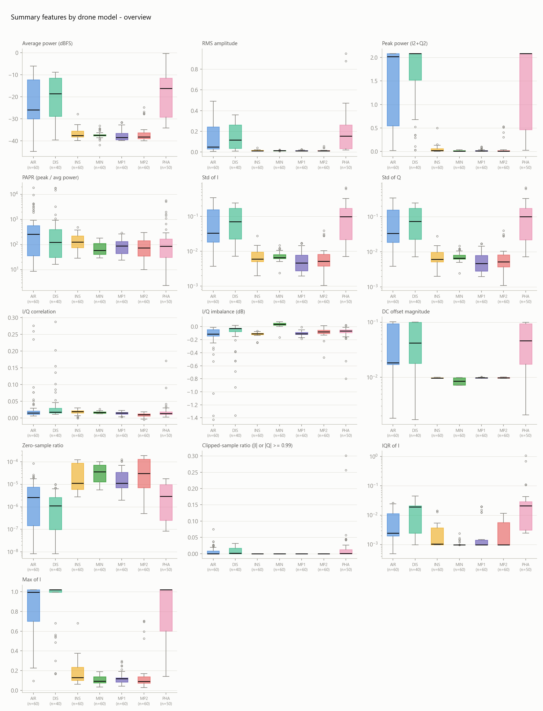
2. **削波（clipping）**：AIR/DIS/PHA 約 50–60% 錄製碰到 ADC full-scale；弱訊號群完全乾淨。兩檔 PHA 嚴重飽和（`BLUE/PHA_ON/PHA_0100_00` 30%、`CLEAN/PHA_ON/PHA_0000_01` 26% 樣本），頻譜分析應剔除。summary 表的 `clip_ratio` 逐檔量化削波程度。
   → 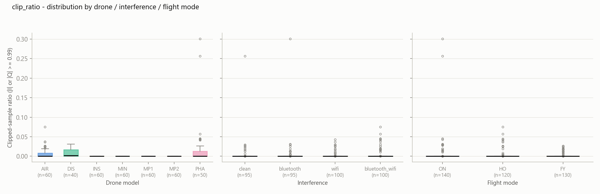
3. 標量統計（`avg_power`、`rms`、`std`）沒有可靠的機型辨識力——被增益 confound 與組內飛行模式變異主導。尺度不變的 `iq_correlation`/`iq_imbalance_db` 較好（2 特徵 RF 5-fold ≈ 0.57），但疑似編碼了 per-session 接收機狀態，故不放入主模型。
4. dB 值在 BI 工具中**絕不可跨錄製做 SUM 或 AVG 聚合**；應先對線性 `avg_power` 平均再轉換（`10·LOG10(AVERAGE(avg_power))`）。

### 分類器比較（leave-one-run-out）

| 模型 | 特徵 | Segment 準確率 | Recording 準確率 |
|---|---|---|---|
| **LDA** | 正規化 1024-bin PSD | **0.972 ± 0.004** | **1.000** |
| XGBoost | 正規化 1024-bin PSD | 0.969 ± 0.006 | 0.987 |
| CNN | 256-bin spectrogram | 0.946 ± 0.009 | 0.977 |
| CNN | 512-bin spectrogram | 0.911 ± 0.030 | 0.933 |
| CNN | 1024-bin spectrogram | *(掃描進行中)* | |

→ 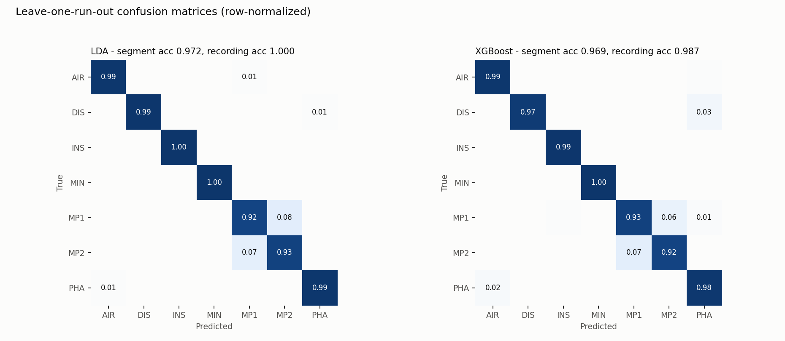 · 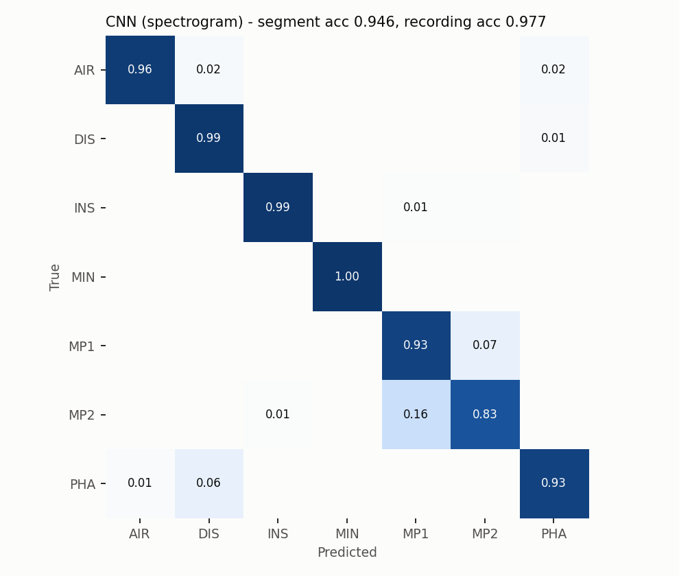

- **頻譜形狀近乎線性可分**；XGBoost 對 LDA 沒有增益，代表結構是線性的、不需重模型。唯一有意義的混淆是 **MP1 ↔ MP2**（7–8%，同家族 OcuSync 圖傳）。
- **CNN 沒有勝過它，而且與直覺相反——提高頻率解析度反而讓它*更差*：** 256-bin 0.946 → 512-bin 0.911，且 fold 間變異增為三倍（±0.009 → ±0.030）。所以先前「CNN 輸是因為被池化到 256 bins」的假設*並非全貌*。更細的 spectrogram 維度更高，但每個 frame 帶入更多未經時間平均的雜訊；在僅約 15k segment 下，固定容量的 CNN 反而過擬合。LDA 的優勢正是它的 PSD 是整段 Welch **時間平均**——一個低方差的高解析度估計，CNN 無法從帶噪的逐 frame column 重建出來。（1024-bin CNN 執行中以確認趨勢。）
- **但 CNN 學到的是互補線索，不是劣化版**。McNemar：CNN vs. 任一 PSD 模型都極顯著（p ≈ 1e-30…1e-37），而 LDA vs. XGBoost 不顯著（p ≈ 0.05）；CNN 獨立答對約 300 個 PSD 模型漏掉的 segment，三模型多數決達 **0.980**。所以 PSD 頻譜形狀是主判別訊號，時頻結構是次要且正交的補充線索。

### 干擾遷移魯棒性（LDA）

| train \ test | clean | bluetooth | wifi | both |
|---|---|---|---|---|
| clean | *0.96* | 0.85 | 0.86 | 0.79 |
| bluetooth | 0.84 | *0.98* | 0.85 | 0.84 |
| wifi | 0.80 | 0.75 | *0.98* | 0.91 |
| both | 0.78 | 0.82 | 0.93 | *0.97* |

→ 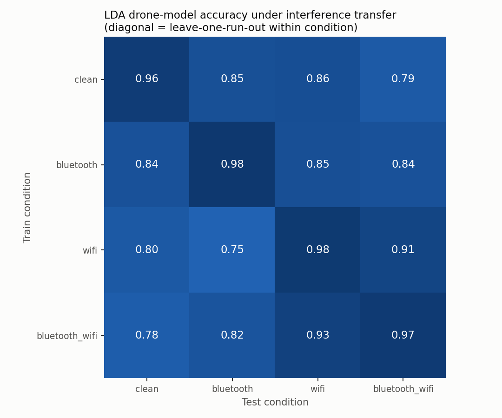

跨條件遷移掉約 12–15 個百分點但不崩盤：無人機訊號本身在未見過的干擾環境下仍支撐 ≥0.75，其餘 in-distribution 準確率依賴環境頻譜背景。WiFi↔Both 互轉維持高分（皆含 WiFi），證實失效模式是背景頻譜佔用改變。

### Session leakage probing + 表示相似度（CKA）

對各表示做線性 probe（GroupKFold 以錄製為單位）；並計算兩者的 CKA。
→ 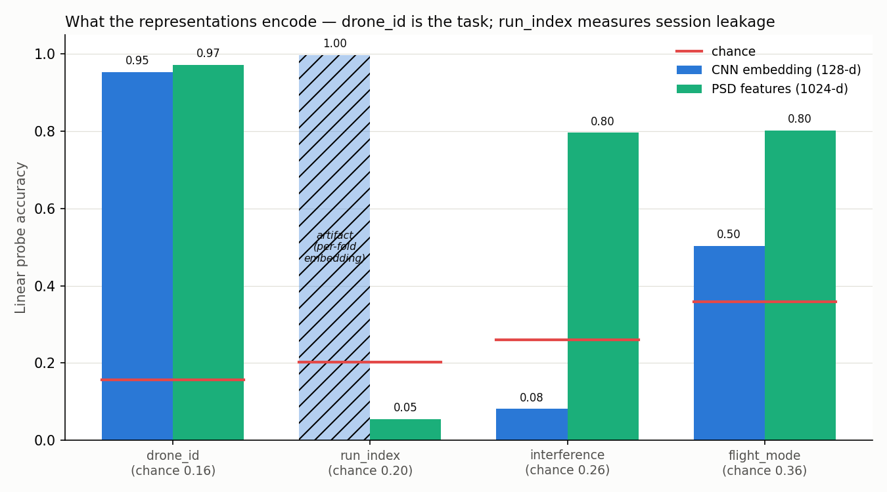

| Probe 目標 | CNN embedding | PSD features | chance |
|---|---|---|---|
| drone_id（主任務） | 0.95 | 0.97 | 0.16 |
| run_index（洩漏） | *1.00 — artifact* | **0.05** | 0.20 |
| interference | **0.08** | 0.80 | 0.26 |
| flight_mode | 0.50 | 0.80 | 0.36 |

- **訊號中沒有 run-level session 指紋**。有效檢驗是 PSD probe（不經任何模型）：`run_index` 為 0.05，*低於* chance。（CNN 的 1.00 是 artifact——embedding 是逐 leave-one-run-out fold 生成的，probe 只是在辨認每個向量出自哪個 fold 的模型，已排除。）
- **CKA(CNN, PSD) = 0.18**（低）：兩表示確實不同——McNemar 所示互補性的第二個獨立佐證。
- CNN embedding 幾乎不編碼干擾（0.08），PSD 則強烈編碼（0.80）。該不變性是 CNN *混合干擾* 訓練的產物，並導出一個假設，被下方的遷移測試**推翻**。

### 干擾遷移：CNN vs. PSD（統一協議）——假設被推翻

對每個條件（runs 0–3）各訓練一個模型；對角線 = 同條件的 held-out run 4，非對角線 = 其他條件。
→ 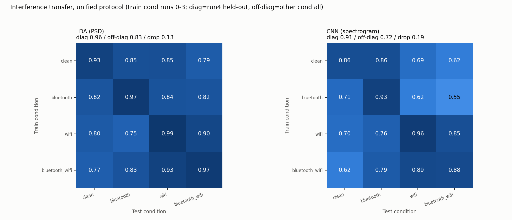

| | 對角線（held-out） | 非對角線（跨干擾） | 掉分 |
|---|---|---|---|
| LDA (PSD) | 0.96 | 0.83 | **0.13** |
| CNN (spectrogram) | 0.91 | 0.72 | **0.19** |

- **CNN 遷移*更差*而非更好**——掉分更大，且每個非對角 cell 都比 LDA 低。
- **為何先前的預測失敗**：probe 的不變性來自「見過全部干擾」的 embedding；而遷移模型各自只在*單一*條件訓練。每個條件僅約 3k segment，高容量 CNN 過擬合訓練條件的背景，線性 LDA 反而泛化更好——經典的「小資料 + 分布外 → 簡單模型勝出」，再次印證 PSD + 線性是魯棒之選。

### 最短觀測窗長度

單窗 LDA 準確率（leave-one-run-out、混合所有干擾、256-bin PSD）對窗長。
→ 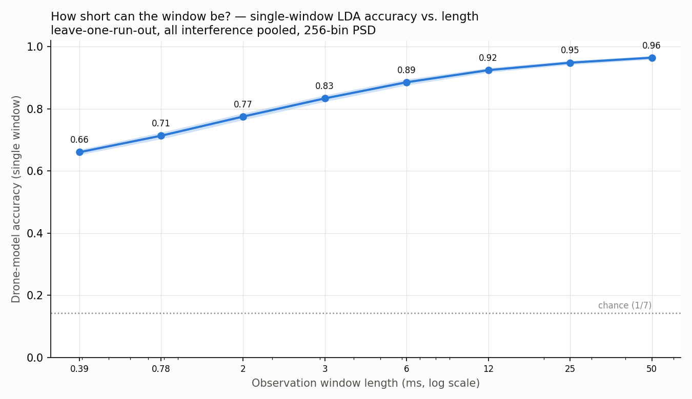

| 窗長 | 0.39 ms | 0.78 ms | 1.6 ms | 3.1 ms | 6.3 ms | 12.5 ms | 25 ms | 50 ms |
|---|---|---|---|---|---|---|---|---|
| 準確率 | 0.66 | 0.71 | 0.78 | 0.83 | 0.89 | 0.92 | 0.95 | 0.96 |

- **即使 0.39 ms 也帶有大量資訊**——單一 spectrogram column 就達 0.66（chance 0.14）。
- **報酬遞減約在 12–25 ms**：25→50 ms 翻倍只多約 1.5 個百分點。甜蜜點：**約 12.5 ms 達低延遲 ≈0.92**、**約 25 ms 達 ≈0.95**。（256-bin PSD；原生 1024-bin 約高 1 個百分點。）

### 單一長窗 vs. 多個短窗投票

把固定的觀測預算花在 V 個不重疊短窗（各自分類後投票），而非一個長窗。
→ 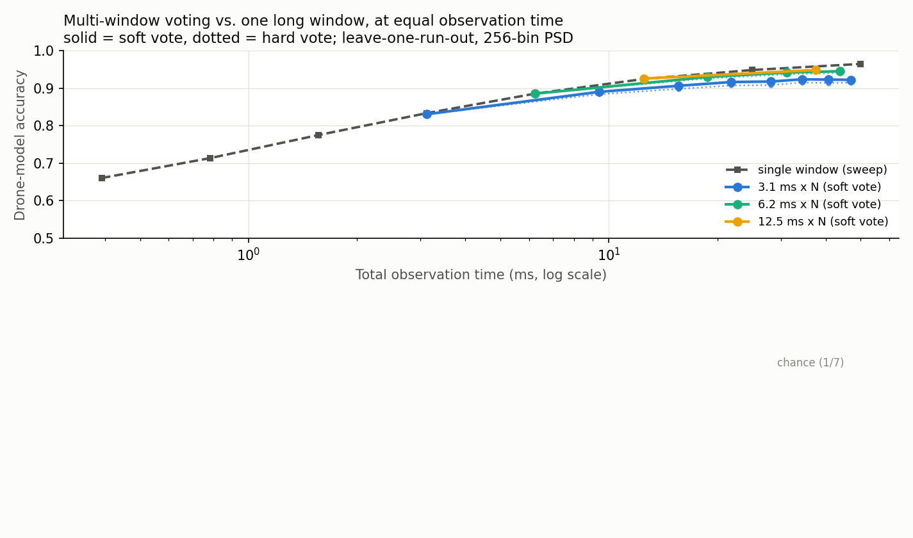

- **soft voting（平均類別機率）勝過 hard voting** 約 0.5–1 個百分點——若要投票就用 soft。
- **但在相同觀測時間下，單一長窗仍 ≥ 投票**。單一 25 ms 窗（0.95）等同於 12.5 ms × 3（37.5 ms，0.948）或 6.25 ms × 7（43.8 ms，0.945）需要*更長*時間才達到的準確率；基本窗越短飽和越低（3.1 ms × N 飽和於約 0.92）。
- **原因**：對 PSD 而言，長窗的 Welch 平均是「特徵層聚合」（降低頻譜估計方差且保留全部資訊），勝過「決策層」的投票。投票僅在觀測斷續或需對抗單一窗被污染時才用。

### 增益不變性與歸因（加分項檢驗）

- **增益擾動壓力測試**：施加 ±20 dB 的測試時增益，正規化 PSD 全程平坦維持 0.96，未正規化的 raw log-power 則崩潰（−20 dB 為 0.51、+20 dB 為 0.60）——確認正規化使特徵增益不變。
  → 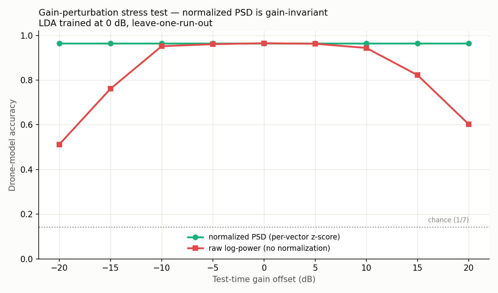
- **Grad-CAM**：在 clean 訓練的 CNN 上，class activation 落在各機型佔用的頻帶，**而非** 0 MHz 的 DC/LO-leakage 線——模型看的是訊號，不是接收端 artifact；各機型有不同頻譜足跡。
  → 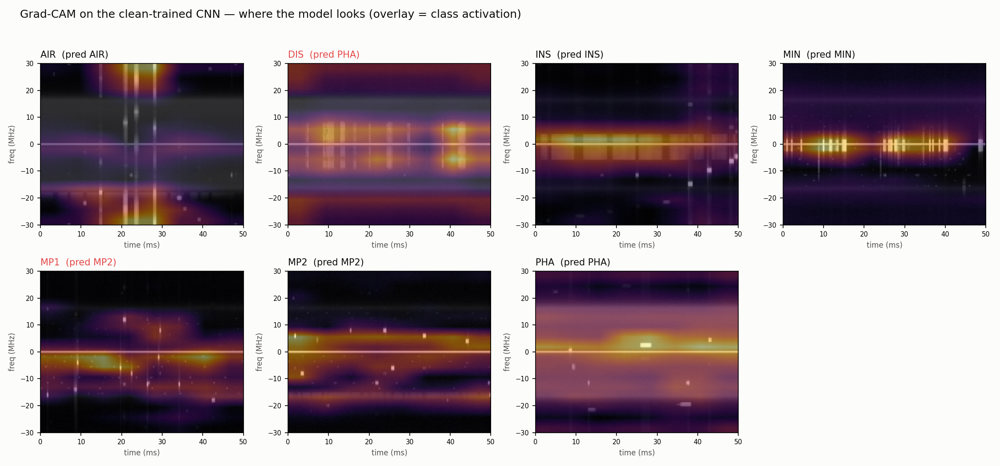

### 誠實聲明（caveats）

- **機型 ≡ session confound 在此結構上無解**：每個機型很可能單一 session 錄製；leave-one-run-out 與 probe 只能排除*session 內重複*的指紋，無法排除 session 身分本身。跨 SDR / 跨日期泛化未經驗證。
- **沒有「無人機不在場」的錄製**——支援機型*分類*，非在場*偵測*（後者需外部負樣本）。
- **256-bin 低估**：窗長與投票研究重用 256-bin spectrogram；原生 1024-bin PSD 約高 1 個百分點。趨勢不受影響。

## Roadmap

1. ~~無損轉換 + 驗證~~ ✔
2. ~~Summary DB + EDA + 資料品質稽核~~ ✔
3. ~~PSD embedding + 線性/GBM baseline + 干擾遷移檢驗~~ ✔
4. ~~Spectrogram CNN + McNemar/ensemble 比較~~ ✔
5. ~~Session leakage probing + CKA~~ ✔
6. ~~CNN 干擾遷移 vs. LDA~~ ✔（假設被推翻）
7. ~~最短窗長度 sweep + 多窗投票~~ ✔
8. ~~Grad-CAM 歸因 + 增益擾動壓力測試~~ ✔
9. 進行中：更高頻率解析度（512-bin）CNN 重跑，嘗試縮小 MP1↔MP2 差距。
